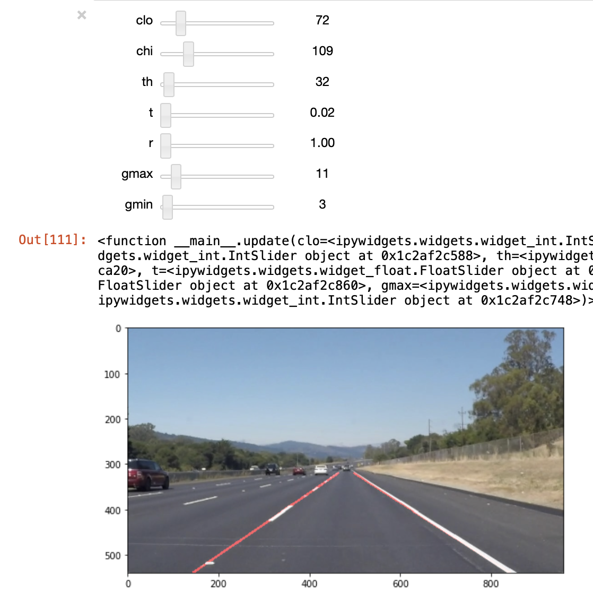
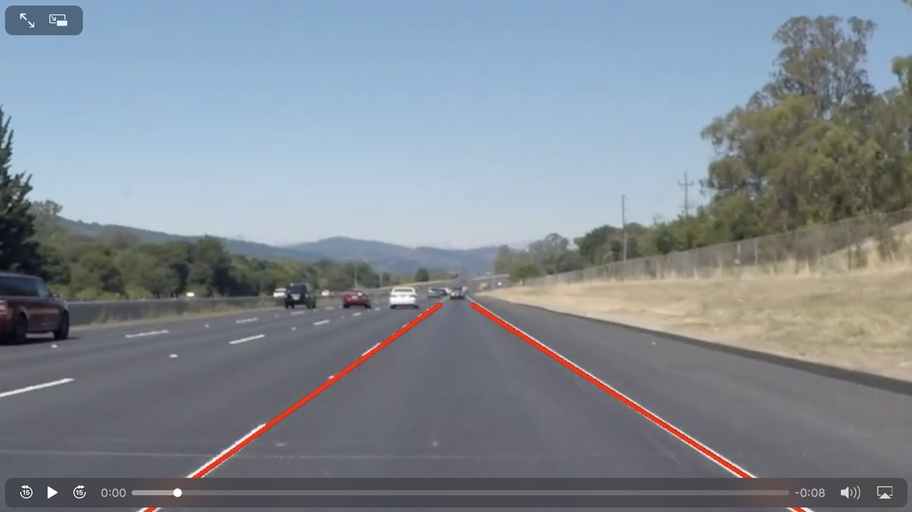

# Lane Finding
## Project Goals

- Make a pipeline to find road lane from image/video

## Description
Below are the steps for my lane detection pipeline:

1. Gaussian filter
2. Region of interest & Canny filter
3. Houge filter
4. Slope filter - remove lines < ±10°
5. Averaging lines and return slope (m) and offset (b)
6. Recreate averaged lines and get verticies (x1, y1, x2, y2)
7. Averaging verticies of current frame (0.5 weight) and all previous frames (0.5 weight)
8. Draw line with avaraged verticies

*_Step #2-3_* apply canny and hough fliter in the region of interested.  I manually eyeball verticies of the region.

Also, I implemented a GUI for step #2-3 to help tweek all tunable parameters, using slider GUI inside Python Notebook.

In *_Step #4_*, the slope filters removes any lines less than ±10°.  This removes all the horizontal lines identified though hough transform.

In *_Step #5 & 6_*, lines are interpolated with `linregress`. averaged slope `m_avg` and offset `b_avg`are calculated to recreate averaged line verticies.

*_Step #7_* nests inside `process_image(...)` function. and average the line verticies with this weighted ratio: *0.5 \* current vertiieces + 0.5 \* all previous frames*.

*Step #8* draw final averaged extrapoated line verticies to image.

## Results

## Potential Short Coming
- Unable to handle curved lane
- Unable to filter shadown or spots with different color within the region of interest

## Possible Improvements
- Average line verticies over fixed # of previous frames, i.e. rolling average window
- Use color filter to further enhance lane finding

